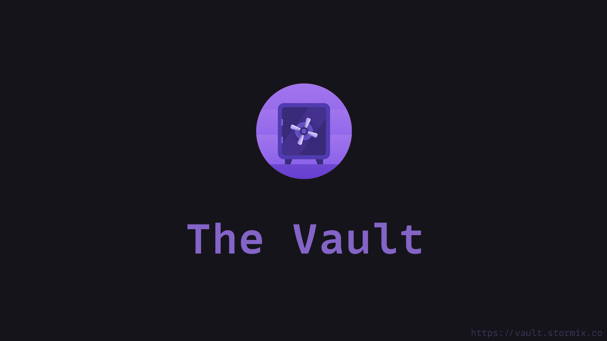

# The Vault

My own personal digital garden. Still a WIP since I need to migrate all my notes from OneNote.


P.S: 
 - I just start using Obsidian recently, so I don't have a lot of notes and the structure will definitely change.
 - The repo is updated automatically by the obsidian-git plugin, so the commits won't be that meaningfull.


## ToDo
- Reorganize notes  (The [P.A.R.A. method](https://fortelabs.co/blog/para/) looks interesting)
- Publish vault as a publicly available website (using [Quartz](https://github.com/jackyzha0/quartz) maybe?)
- List all enabled plugins

### Bookmarklet

Drag this [Send to Obsidian](https://stormix.co) to your bookmarks, right-click and select edit, paste the following instead of the link.

```javascript
javascript: (function () {
  const title = document.title;
  const selectedText = window.getSelection().toString();
  const url = document.location.href;
  const tag = '#saved_from_chrome';
  const content = `# ${title} ${
    selectedText != "" ?
      `${"\n"} > ${selectedText.replaceAll("\n", "\n> ")}`
      : ""
    } ${"\n\n"} - [${title}](${url}) ${"\n\n"} ${tag}`;
  document.location.href =
  `obsidian://new?name=${encodeURIComponent(title)}&content=${encodeURIComponent(content)}&vault=TheVault`
})();
```

### Credits

- Thanks to Brewex for the [Vault Icon](https://dribbble.com/shots/12878749-Onboarding-Illustration-1)
- Thanks to Chetachi for the awesome looking [Ying and Yang](https://github.com/chetachiezikeuzor/Yin-and-Yang-Theme) theme used here
- Font: https://www.monolisa.dev/
- PARA Starter Kit: https://forum.obsidian.md/t/para-starter-kit/223